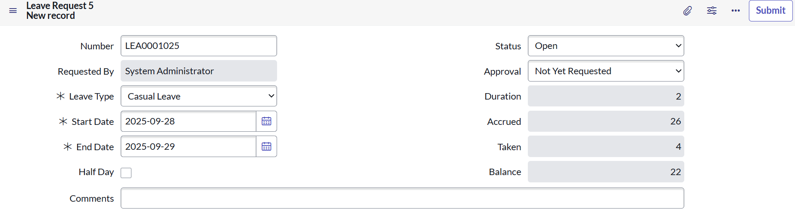

#  Flexi Leave - ServiceNow Scoped Application

  

Flexi Leave is a **ServiceNow-based scoped application** designed to simplify and automate the employee leave request process.  
It dynamically populates fields, validates data, and automates approvals, providing a smooth and efficient leave management experience.  

---

##  Features
- Auto-populates leave request fields such as:
  - **Requester**, **Status**, **Approval**, **Duration**, and **Leave Balance**  
- Handles **date calculations** to compute leave duration (including half-day requests)  
- Automates leave approval workflow through **Flow Designer**  
- Prevents duplicate requests and ensures data consistency  

---

##  ServiceNow Components Used

###  Data Tables
- **Leave Calculator** – Stores leave calculation logic  
- **Leave Request** – Captures employee leave details  
- **Leave Bucket** – Tracks leave balances  

###  Business Rules
- **Calculate Leaves** *(Async)* – Computes leave duration and updates balances  
- **Create Leave Bucket** *(Async)* – Initializes leave balance for employees  
- **Prevent Duplicates** *(Before)* – Ensures no duplicate leave requests  

###  Script Includes
- Reusable server-side logic for calculations and validations  

###  Client Scripts
- **Populate** – Auto-populates key fields  
- **Set Duration** – Calculates leave duration  
- **Set Duration for Half Day** – Special handling for half-day requests  

###  UI Policies
- **Hide End Date for Half Day** – Simplifies the form for half-day requests  
- **Make Fields Mandatory** – Ensures required information is captured  

###  Flow Designer
- Automates leave request approvals by routing them to the **employee’s manager**  
